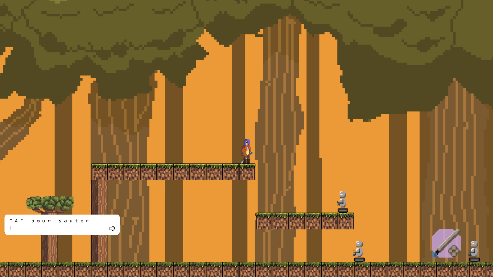

Daydream est un jeu vidéo qui a été développé dans le cadre du cours jeux vidéo 2D dispensé par Loïc Cattani. Il a été codé en javascript avec Kaplay.

Vous incarnez Sol qui part en quête de libérer la forêt de l'industrialisation par les robots. Dans ce platformer d'action, appuyez-vous sur vos réflexes pour naviguer à travers les niveaux à l'aide de métamorphoses.

Le jeu a été pensé pour être joué à la manette. Il existe tout de même des contrôles clavier, non-indiqués dans le jeu qui sont les suivants:

Mouvements: WASD ou flèches directionnelles / Pad directionnel

Sauter: Espace / A (bouton bas)

Attaquer: E / X (bouton gauche)

Passer les dialogues: F / B (bouton droite)

Transformation : Q / R1

(La touche K provoque un game over dans le cas d'un soft lock ou un bug)

Le jeu est disponible sur itch.io : https://guilherme567.itch.io/daydream

Tous les assets du jeu ont été crées par moi, sauf les sons et musiques :
alert.wav by danielnieto7 -- https://freesound.org/s/135613/ -- License: Attribution NonCommercial 3.0
Spinning Cable 192kHz.wav by JarredGibb -- https://freesound.org/s/219031/ -- License: Attribution 4.0
SFX Door Open.wav by Paul368 -- https://freesound.org/s/264061/ -- License: Creative Commons 0
boulderfall1.mp3 by AGC66 -- https://freesound.org/s/393865/ -- License: Attribution NonCommercial 3.0
Boss Battle Loop #3 by Sirkoto51 -- https://freesound.org/s/443128/ -- License: Attribution 4.0
Explosion, 8-bit, 01.wav by InspectorJ -- https://freesound.org/s/448226/ -- License: Attribution 4.0
BowzerGunGameReady.wav by FrazierWing -- https://freesound.org/s/638301/ -- License: Creative Commons 0